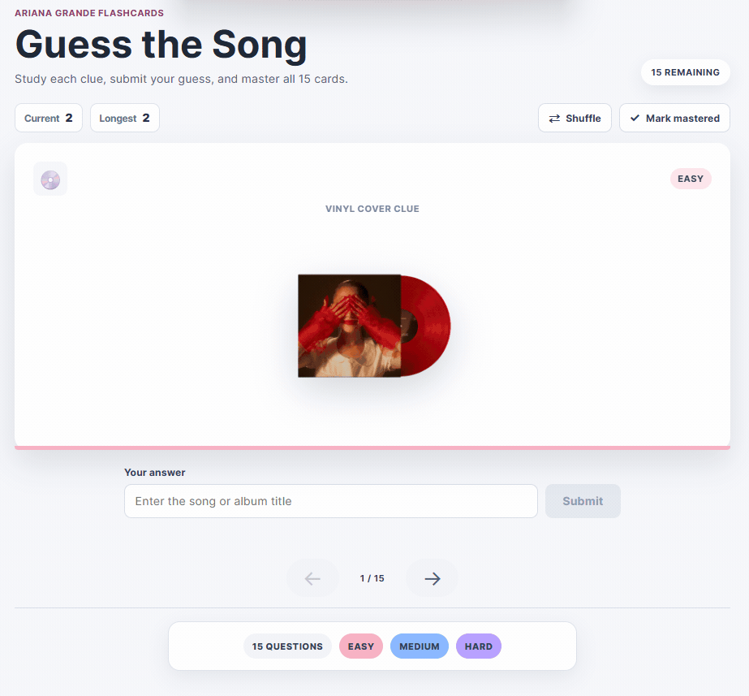

# Web Development Project 3 - *Guess the Song*

Submitted by: **Yaritza Yanez**

This web app: **An Ariana Grande-themed flashcard game where users identify songs and albums from lyric-inspired clues or vinyl cover images. Users can submit guesses, track answer streaks, shuffle the cards, and mark cards as mastered.**

Time spent: **3** hours spent in total

## Required Features

The following **required** functionality is completed:

- [x] **The user can enter their guess into an input box *before* seeing the flipside of the card**
  - Application features a clearly labeled input box with a submit button where users can type in a guess
  - Clicking on the submit button with an **incorrect** answer shows visual feedback that it is wrong
  - Clicking on the submit button with a **correct** answer shows visual feedback that it is correct
- [x] **The user can navigate through an ordered list of cards**
  - A forward/next button displayed on the card navigates to the next card in a set sequence when clicked
  - A previous/back button displayed on the card returns to the previous card in the set sequence when clicked
  - Both the next and back buttons visually indicate when the user is at the beginning or end of the list by becoming disabled, preventing wrap-around navigation

The following **optional** features are implemented:

- [x] Users can use a shuffle button to randomize the order of the cards
  - Cards remain in the same sequence (**NOT** randomized) unless the shuffle button is clicked
  - Cards change to a random sequence once the shuffle button is clicked
- [x] A user's answer may be counted as correct even when it is slightly different from the target answer
  - Answers are considered correct when they meaningfully match part of the answer on the card
  - Matching ignores uppercase/lowercase discrepancies, punctuation discrepancies, extra spaces, and small spelling mistakes
- [x] A counter displays the user's current and longest streak of correct responses
  - The current counter increments when a user guesses an answer correctly
  - The current counter resets to 0 when a user guesses an answer incorrectly
  - A separate counter tracks the longest streak and updates when the current streak exceeds it
- [x] A user can mark a card that they have mastered and have it removed from the pool of displayed cards
  - The user can mark a card to indicate that it has been mastered
  - Mastered cards are removed from the active pool and added to a separate list of mastered cards

The following **additional** features are implemented:

* [x] Added 15 Ariana Grande flashcards with easy, medium, and hard difficulty categories
* [x] Added five vinyl-cover image questions in addition to lyric-inspired text questions
* [x] Added animated card flipping with answers displayed on the reverse side
* [x] Added responsive styling for desktop and mobile screens
* [x] Separated card data, flashcards, answer input, navigation, study controls, and mastered cards into reusable React modules

## Video Walkthrough

Here's a walkthrough of implemented user stories:

GIF created with [ScreenToGif](https://www.screentogif.com/) for Windows.

## Notes

The main challenges were keeping ordered navigation separate from the shuffled card sequence, preventing repeated correct submissions from inflating the streak, and removing mastered cards without breaking the current card position. Answer matching uses normalization, partial matching, and edit distance so small differences can still be accepted.

## License

    Copyright [2026] [Yaritza Yanez]

    Licensed under the Apache License, Version 2.0 (the "License");
    you may not use this file except in compliance with the License.
    You may obtain a copy of the License at

        http://www.apache.org/licenses/LICENSE-2.0

    Unless required by applicable law or agreed to in writing, software
    distributed under the License is distributed on an "AS IS" BASIS,
    WITHOUT WARRANTIES OR CONDITIONS OF ANY KIND, either express or implied.
    See the License for the specific language governing permissions and
    limitations under the License.

---

# Part 1 README

# Web Development Project 2 - *Guess the Song*

Submitted by: **Yaritza Yanez**

This web app: **an Ariana Grande themed flashcard game where players read a lyric-inspired clue or look at a stylized vinyl cover, click the card to reveal the song title, and move to a random new card.**

Time spent: **3** hours spent in total

## Required Features

The following **required** functionality is completed:

- [x] **The app displays the title of the card set, a short description, and the total number of cards**
  - [x] Title of card set is displayed
  - [x] A short description of the card set is displayed
  - [x] A list of card pairs is created
  - [x] The total number of cards in the set is displayed
  - [x] Card set is represented as a list of card pairs (an array of dictionaries where each dictionary contains the question and answer is perfectly fine)
- [x] **A single card at a time is displayed**
  - [x] Only one half of the information pair is displayed at a time
- [x] **Clicking on the card flips the card over, showing the corresponding component of the information pair**
  - [x] Clicking on a card flips it over, showing the back with corresponding information
  - [x] Clicking on a flipped card again flips it back, showing the front
- [x] **Clicking on the next button displays a random new card**

The following **optional** features are implemented:

- [x] Cards contain images in addition to or in place of text
  - [x] Some or all cards have images in place of or in addition to text
- [x] Cards have different visual styles such as color based on their category
  - Example categories you can use:
    - Difficulty: Easy/medium/hard
    - Subject: Biology/Chemistry/Physics/Earth science

The following **additional** features are implemented:

* [x] Added 15 Ariana Grande song cards with difficulty labels.
* [x] Added 5 vinyl-cover guessing cards that use image clues instead of text clues.
* [x] Added a random-card function that avoids immediately repeating the current card.
* [x] Added responsive styling for desktop and mobile screens.

## Video Walkthrough

Here's a walkthrough of implemented required features:

GIF created with [ScreenToGif](https://www.screentogif.com/) for Windows.

## Notes

The main challenge was making sure the next card appears in random order instead of moving sequentially. The app also uses lyric-inspired clue summaries instead of copying full song lyrics.

## License

    Copyright [2026] [Yaritza Yanez]

    Licensed under the Apache License, Version 2.0 (the "License");
    you may not use this file except in compliance with the License.
    You may obtain a copy of the License at

        http://www.apache.org/licenses/LICENSE-2.0

    Unless required by applicable law or agreed to in writing, software
    distributed under the License is distributed on an "AS IS" BASIS,
    WITHOUT WARRANTIES OR CONDITIONS OF ANY KIND, either express or implied.
    See the License for the specific language governing permissions and
    limitations under the License.
